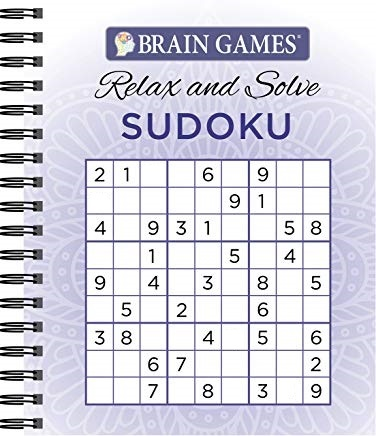
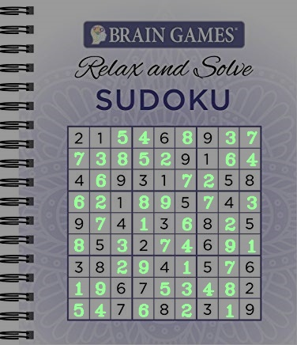
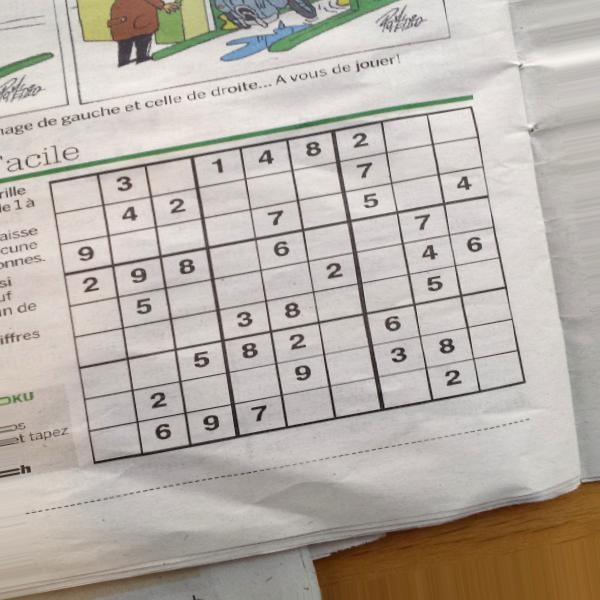
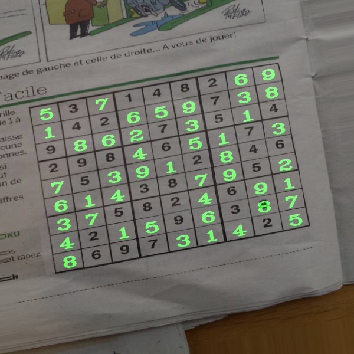
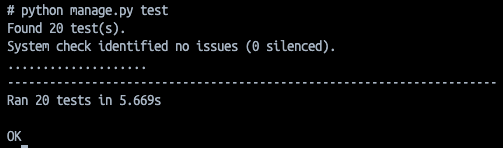

# Sudoku Solver API


## Author:

Jacob Bassett


## Date:

4/29/2024
 

## Version:

1.0.0

## What it does:

It will accept a HTTP request with a unsolved image of a sudoku puzzle and return a solved image of that puzzle. It only accepts PNG and JPG images. Best results are found with...

1. Only submit JPG and PNG files.
1. No handwriting.
1. Puzzle should take up the majority of the image.
1. Puzzle border shouldn't be surrounded by another border.
1. Constant background.
1. No extreme angles.

This is an example of a good puzzle.



Ideal results.



This is an example of a poor puzzle that might not produce great results.



Thankfully the api was able to handle it but for best results follow the rules above to avoid poor outputs.



Note their is a timeout element. If a solution isn't reached within 1 minute, the API will send a error back.


## How to use:

1. Clone this down from the Github Repository.

1. Create Docker Container with this command. (You will need Docker Desktop for this to work.)

```bash
docker-compose up
```

1. Run unit tests by entering container terminal. (Can access this through Docker Desktop.)

```bash
python manage.py test
```



1. Make requests to local api with the following command from a different terminal.

```bash
curl -X POST \
  'http://0.0.0.0:8000/api/v1/solve/' \
  -H 'Accept: */*' \
  -H 'User-Agent: Thunder Client (https://www.thunderclient.com)' \
  -F 'puzzle=@/path-to-local-directory/data/puzzles/1.jpg' \
  -o file-name.jpg
```